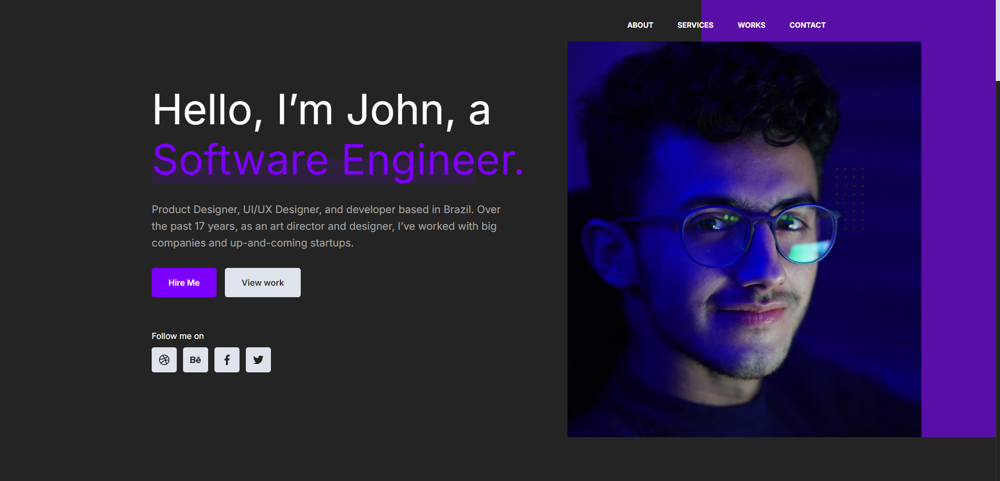

# Hypesoft Code Challenge

## 💻 Sobre o projeto

O projeto é baseado em um prototipo desenvolvido pela Hypesoft, desenvolvido como parte do processo seletivo para desenvolvedor Front End

## 🎨 Layout



## Deploy
- [Deploy](https://hypesoft-project.vercel.app/)

## 🚀 Como executar o projeto

### Pré-requisitos

Antes de começar, você vai precisar ter instalado em sua máquina as seguintes ferramentas:

- [Git](https://git-scm.com)
- [Node.js](https://nodejs.org/en/).

💡 Além disto é bom ter um editor para trabalhar com o código como [VSCode](https://code.visualstudio.com/)

### Executando a aplicação

```bash

# Clone este repositório
$ git clone https://github.com/joaolucasMota/hypesoft-projec

# Acesse a pasta do projeto no seu terminal/cmd
$ cd hypesoft-project

# Instale as dependências
$ npm install

# Execute a aplicação em modo de desenvolvimento
$ npm run dev

```

## 🛠 Tecnologias Utilizadas

As seguintes ferramentas foram usadas na construção do projeto:

### Website

- **[React](https://react.dev/)**
- **[TypeScript](https://www.typescriptlang.org/)**
- **[Next](https://nextjs.org/)**
- **[Yup](https://www.npmjs.com/package/yup)**
- **[EmailJs](https://www.npmjs.com/package/yup)**
- **[Jest](https://jestjs.io/pt-BR/)**


### Utilitários

- Protótipo: **[Figma](https://www.figma.com/)** → **[Hypesoft](https://www.figma.com/design/wk1JMamLja1wvxKuc32thb/Hypesoft---Desafio?node-id=0-1&t=mg0sWGphnLDCyf7Z-0)**
- Editor: **[Visual Studio Code](https://code.visualstudio.com/)**


## 📝 Licença

Este projeto está sob a licença MIT. Veja o arquivo [LICENSE](./LICENSE) para mais detalhes.
